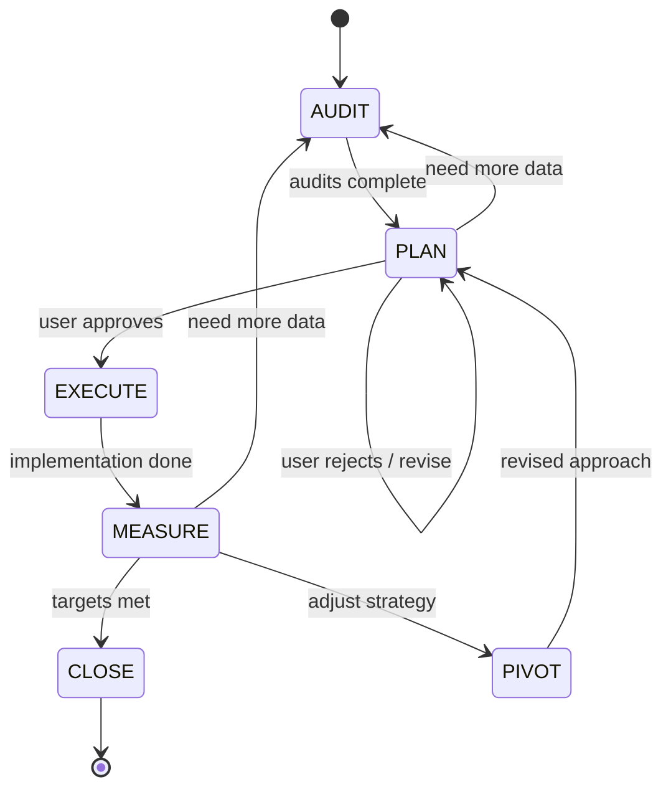

# SEO Planner

[](LICENSE)
[](VERSION)
[](https://github.com/NikolasMarkou/iterative-planner)

Without structure, SEO is guesswork — random blog posts, scattered fixes, and hope. SEO Planner prevents this by enforcing structured 90-day sprints: a [Claude Code](https://docs.anthropic.com/en/docs/claude-code) skill that runs a state machine — **Audit, Plan, Execute, Measure, Pivot**. The filesystem is persistent memory. Every audit finding, every decision, every lesson learned is written to disk and survives context window compression.

Works for any website. Install once, use across all projects.

> **Built on** [Iterative Planner](https://github.com/NikolasMarkou/iterative-planner) by [Nikolas Markou](https://github.com/NikolasMarkou). The original project solved the problem of structured iteration for coding tasks — we adapted its state machine, filesystem persistence, and cross-plan intelligence architecture for SEO optimization. SEO frameworks inspired by [Flavio Amiel (@fba)](https://x.com/fba).

---

## When to Use This

| Use it | Skip it |
|--------|---------|
| Full-site SEO optimization (technical + content + links) | Fixing a single meta tag |
| Building content architecture from scratch | Writing one blog post |
| 90-day growth sprints with measurable targets | Quick keyword research |
| Sites stuck at a traffic plateau | Sites already ranking #1 |
| Competitor analysis and gap identification | |
| Technical SEO audits across hundreds of pages | |
| Any SEO project where "just publish more" leads to wasted effort | |

Trigger phrases: *"optimize this site's SEO"*, *"run an SEO audit"*, *"plan an SEO sprint"*, *"why isn't this site ranking?"*, *"build a content strategy"*

---

## Get Started in 60 Seconds

**Requires**: Node.js 18+ (for bootstrap script)

**Option 1: Clone and install (recommended)**
```bash
git clone https://github.com/drixzor/seo-planner.git
cp -r seo-planner/src ~/.claude/skills/seo-planner
```

**Option 2: Install sub-agents** (optional, enables parallel dispatch)
```bash
mkdir -p ~/.claude/agents
cp seo-planner/src/agents/*.md ~/.claude/agents/
```

Then open Claude Code in any website project and say: **"optimize this site's SEO"**

---

## How It Works

Six states. Every transition logged. Every decision recorded. The filesystem is the source of truth, not the context window.



| State | What happens | Guardrails |
|-------|-------------|------------|
| **AUDIT** | Technical audit, content audit, backlink analysis, competitor research. 4 structured reports. | Read-only. All findings go to `audit/` directory. ≥4 audit reports required before PLAN. |
| **PLAN** | Build topical map, content calendar, technical fix list, link building strategy. Set KPI targets. | No site changes yet. User must approve strategy before execution. |
| **EXECUTE** | Implement changes: create content, fix technical issues, add schema, build internal links. | One task at a time. 2 fix attempts max. Checkpoint before risky changes. |
| **MEASURE** | Check rankings, traffic, indexation, Core Web Vitals, conversions against targets. | Evidence-based. SCORE framework evaluation. Regressions block CLOSE. |
| **PIVOT** | Adjust strategy based on data — what keywords aren't moving, what content isn't ranking. | Must explain what failed and why. User approves new direction. |
| **CLOSE** | Document results, SCORE change, lessons learned. Merge knowledge to consolidated files. | Clean output. LESSONS.md updated for next sprint. |

### Sprint Limits

Sprints increment on each PLAN to EXECUTE transition. The protocol enforces hard limits:

- **Sprint 4**: Mandatory decomposition analysis — identify 2-3 independent workstreams that could each be a separate sprint.
- **Sprint 5+**: Hard stop. The task must be broken into smaller sprints.

---

## Why This Works

### Persistent Memory

Everything important lives on disk, not the context window.

```
plans/
+-- .current_plan               # active sprint directory name
+-- FINDINGS.md                 # Consolidated audit findings across all sprints (newest first)
+-- DECISIONS.md                # Consolidated SEO decisions across all sprints (newest first)
+-- LESSONS.md                  # What works for THIS site (max 200 lines, rewritten each sprint)
+-- INDEX.md                    # Sprint history and topic mapping
+-- plan_2026-04-26_a1b2c3d4/
    +-- state.md                # Current state, step, sprint iteration
    +-- plan.md                 # Living SEO strategy (topical map, calendar, KPIs)
    +-- decisions.md            # Append-only log of every decision and pivot
    +-- findings.md             # Index of audit discoveries
    +-- findings/               # Detailed finding files
    +-- audit/                  # Structured audit reports
    |   +-- technical.md        # Page speed, CWV, crawlability, schema, mobile
    |   +-- content.md          # Content gaps, topical coverage, internal links
    |   +-- backlinks.md        # Link profile, DR, toxic links, competitor gap
    |   +-- competitors.md      # Top 3-5 competitors: strategy, tech, content, links
    +-- progress.md             # Done vs remaining
    +-- verification.md         # SEO metrics tracking (rankings, traffic, CWV, indexation)
    +-- checkpoints/            # Snapshots before risky changes
    +-- lessons_snapshot.md     # LESSONS.md snapshot at close
    +-- summary.md              # Sprint summary with SCORE change
```

State, decisions, findings, and progress are recoverable across conversation restarts.

**Mandatory re-reads** keep the agent grounded: `state.md` is re-read every 10 tool calls. After 50 messages, the agent re-reads `state.md` + `plan.md` before every response. The filesystem is truth, not memory.

### Cross-Sprint Intelligence

When a sprint closes, its audit findings and decisions merge into consolidated files at the `plans/` root. The next sprint reads them during AUDIT. This means:

- Sprint 2 **builds on** everything Sprint 1 learned about the site
- Failed keyword strategies are **visible to future sprints**, preventing repeated dead ends
- Content that worked well is **documented** so the system doubles down on winners
- Technical fixes carry forward — no re-auditing what's already fixed

Consolidated files are naturally bounded by a **sliding window**: bootstrap trims them to the 8 most recent sprint sections on each close.

### The SCORE Framework

Every sprint is evaluated against 5 dimensions, scored 1-5:

| Dimension | What it measures |
|-----------|-----------------|
| **S**ite Optimization | Technical SEO: page speed, CWV, mobile, crawlability, schema |
| **C**ontent Production | Topical map, content clusters, briefs, publishing cadence, quality |
| **O**utside Signals | Backlinks, brand mentions, social signals, digital PR |
| **R**ank Enhancement | Growth experiments, content refresh, featured snippets, GSC mining |
| **E**valuate Results | Analytics, tracking, KPIs, conversion attribution, ROI |

SCORE is assessed at sprint start and sprint end. The delta shows exactly where progress was made.

### Content Architecture First

The #1 mistake in SEO is writing content before building architecture. This planner enforces the right order:

1. **Topical map** — brain dump every keyword your ICP searches, map search intent, build content hierarchy
2. **Pillar pages** — comprehensive guides for main themes (2000+ words)
3. **Content clusters** — 5-10 supporting articles per pillar, internally linked
4. **Internal linking** — hub-spoke architecture, no orphan pages
5. **THEN create content** — every piece connected to the architecture

### Built-in SEO Frameworks

| Framework | What it does |
|-----------|-------------|
| **SCORE evaluation** | Score site 1-5 on 5 dimensions. Focus sprints where scores are lowest. |
| **Topical map architecture** | Pillar-cluster content model. Build authority, not random posts. |
| **45-point on-page checklist** | Title, meta, headings, images, schema, internal links, UX, CTA. |
| **Technical SEO audit** | Lighthouse, CWV, crawlability, indexation, schema, mobile, redirects. |
| **Backlink strategy** | Digital PR, AI-powered link acquisition, foundational links, anchor text. |
| **Programmatic SEO** | Templates + data for scalable pages (tools, comparisons, directories). |
| **90-day sprint model** | Month 1-2: foundation. Month 3: momentum. Not years of retainers. |

### Autonomy Leash

When a task fails during EXECUTE, the agent gets 2 fix attempts. If neither works, it stops, reverts, and asks you. No silent spiraling.

### Revert-First Complexity Control

The default response to failure is to **simplify, never to add**:

1. Can I fix by **reverting**? Do that.
2. Can I fix by **deleting**? Do that.
3. **One-line** fix? Do that.
4. None of the above? **Stop.** Enter MEASURE.

---

## Bootstrapping

Manage SEO sprints from your project root:

```bash
node <skill-path>/scripts/bootstrap.mjs new "goal"           # Start new sprint
node <skill-path>/scripts/bootstrap.mjs new --force "goal"   # Close active sprint, start new
node <skill-path>/scripts/bootstrap.mjs resume               # Resume after context loss
node <skill-path>/scripts/bootstrap.mjs status               # One-line status
node <skill-path>/scripts/bootstrap.mjs close                # Close sprint (merges + preserves)
node <skill-path>/scripts/bootstrap.mjs list                 # Show all sprints
```

**`new`** creates the sprint directory under `plans/`, writes audit templates, creates consolidated files if they don't exist, and drops the agent into AUDIT.

**`close`** merges per-sprint findings and decisions into the consolidated files, appends to the topic index, snapshots LESSONS.md, removes the pointer, and preserves the sprint directory.

**`resume`** outputs the current sprint state for re-entry. Use it at the start of a new conversation or after context compression.

Bootstrap automatically adds `plans/` to `.gitignore`.

---

## Sub-Agents

The planner dispatches specialized agents per state:

| Agent | State | Model | Purpose |
|-------|-------|-------|---------|
| `seo-auditor` | AUDIT | sonnet | Technical/content/backlink/competitor audits (parallel) |
| `seo-strategist` | PLAN | inherit | Strategy design, topical mapping, content calendar |
| `seo-executor` | EXECUTE | inherit | Implement one SEO task (content, technical, links) |
| `seo-measurer` | MEASURE | sonnet | Metrics collection, verification checks |
| `seo-reviewer` | MEASURE | opus | Adversarial review (sprint 2+) |
| `seo-archivist` | CLOSE | sonnet | Sprint documentation, LESSONS.md update |

Sub-agents are optional. Without them, the main agent handles everything. With them, audits run in parallel and reviews are adversarial.

---

## FAQ

**Can I use this across multiple projects?**
Yes. Install the skill once to `~/.claude/skills/seo-planner/`. The `plans/` directory is created per-project. Each site builds its own LESSONS.md.

**What if bootstrap refuses to create a new sprint?**
An active sprint already exists. Use `resume` to continue it, `close` to end it, or `new --force` to close and start fresh.

**Can I have multiple active sprints at once?**
No. One active sprint per project, tracked by `plans/.current_plan`. Close the current sprint before starting a new one.

**Are plan files committed to git?**
No. Bootstrap adds `plans/` to `.gitignore` by default.

**What happens at sprint 4?**
Mandatory decomposition analysis: identify 2-3 independent workstreams. At sprint 5+, execution stops entirely and the decomposition is presented.

**What SEO tools does it need?**
None required. It works with whatever data is available (site files, HTML, robots.txt, sitemap). For richer audits, connect Google Search Console, Ahrefs, or SEMrush data.

---

## Project Structure

```
seo-planner/
+-- README.md                 # This file
+-- CLAUDE.md                 # AI assistant guidance
+-- VERSION                   # 1.0.0
+-- src/
    +-- SKILL.md              # Core protocol (the complete skill specification)
    +-- agents/               # Sub-agent definitions (installed to ~/.claude/agents/)
    |   +-- orchestrator.md   # State machine owner, dispatches all other agents
    |   +-- seo-auditor.md    # Read-only SEO auditing (AUDIT phase)
    |   +-- seo-strategist.md # Strategy and plan generation (PLAN phase)
    |   +-- seo-executor.md   # Implementation (EXECUTE phase)
    |   +-- seo-measurer.md   # Metrics and verification (MEASURE phase)
    |   +-- seo-reviewer.md   # Adversarial review (MEASURE phase, sprint >= 2)
    |   +-- seo-archivist.md  # Sprint documentation (CLOSE phase)
    +-- scripts/
    |   +-- bootstrap.mjs     # Sprint directory management (Node.js 18+)
    +-- references/
        +-- technical-seo.md        # Technical SEO checklist (CWV, crawl, schema, mobile)
        +-- content-strategy.md     # Topical maps, pillar-cluster architecture, pSEO
        +-- backlink-strategy.md    # Link building frameworks, digital PR, anchor text
        +-- on-page-seo.md          # 45-point on-page optimization checklist
        +-- scoring-framework.md    # SCORE evaluation rubric and sprint milestones
        +-- file-formats.md         # Templates for every plan directory file
```

For the complete protocol specification, see [`src/SKILL.md`](src/SKILL.md).

---

## Acknowledgements

This project is built on the architecture of [Iterative Planner](https://github.com/NikolasMarkou/iterative-planner) by [Nikolas Markou](https://github.com/NikolasMarkou). His work on state-machine driven planning, filesystem persistence, and cross-plan intelligence made this possible. We adapted his system from coding tasks to SEO optimization — the core state machine, autonomy leash, complexity control, and consolidated file management are directly inspired by his design.

SEO frameworks and strategies are based on the work of [Flavio Amiel (@fba)](https://x.com/fba), whose SCORE framework, 90-day sprint model, and content-architecture-first approach form the SEO methodology embedded in this planner.

---

## License

[GNU General Public License v3.0](LICENSE) — same as [Iterative Planner](https://github.com/NikolasMarkou/iterative-planner).
