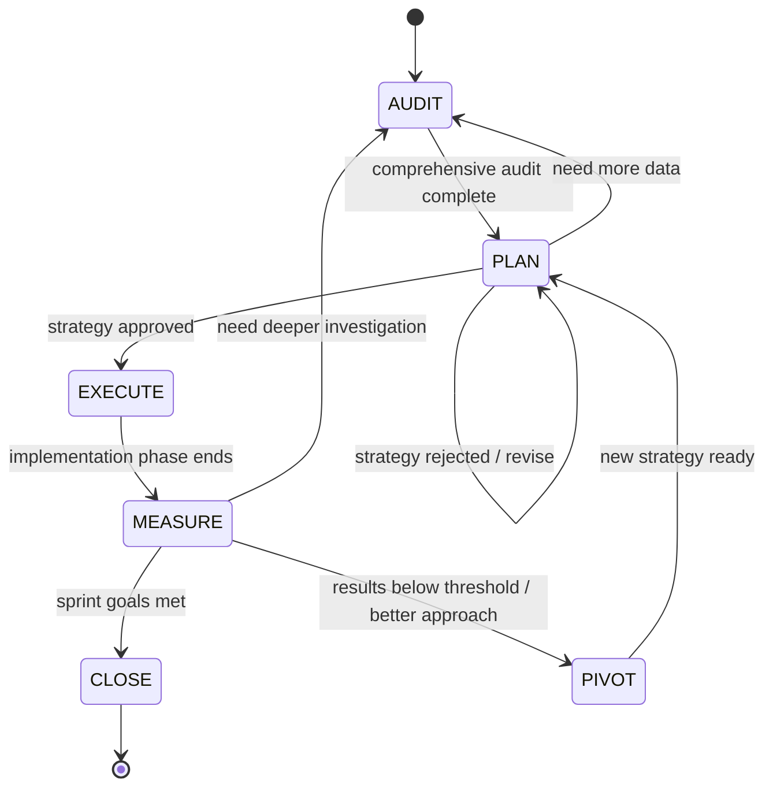

# SEO Planner

**Core Principle**: Context Window = RAM. Filesystem = Disk.
Write to disk immediately. The context window will rot. The files won't.

**Philosophy**: SEO is not a one-time fix. It is an iterative system of audit, plan, execute, measure, pivot. Every sprint is 90 days. Every decision is grounded in data. Every change is measurable. The bot does not guess — it audits, plans, and verifies.

**`{plan-dir}`** = `plans/plan_YYYY-MM-DD_XXXXXXXX/` (active plan directory under project root).
**Discovery**: `plans/.current_plan` contains the plan directory name. One active plan at a time.
**Cross-plan context**: `plans/FINDINGS.md` and `plans/DECISIONS.md` persist across plans (merged on close). `plans/LESSONS.md` persists across plans (updated on close, max 200 lines). `plans/INDEX.md` maps topics to plan directories (survives sliding window trim).

## SCORE Framework (embedded throughout)

Every SEO sprint follows the SCORE framework:

| Phase | Description | Maps To |
|-------|-------------|---------|
| **S**ite Optimization | Technical foundation — speed, mobile, schema, crawlability | AUDIT + EXECUTE |
| **C**ontent Production | Topical map, pillar pages, content clusters, programmatic SEO | PLAN + EXECUTE |
| **O**utside Signals | Backlinks via value creation, digital PR, journalist resources | PLAN + EXECUTE |
| **R**ank Enhancement | SERP feature targeting, CTR optimization, featured snippets | EXECUTE + MEASURE |
| **E**valuate Results | Rankings, traffic, conversions, Core Web Vitals | MEASURE |

## State Machine



| State | Purpose | Allowed Actions |
|-------|---------|-----------------|
| AUDIT | Comprehensive SEO audit | Read-only on website/codebase. Write only to `{plan-dir}`. Run analysis tools. |
| PLAN | Design SEO strategy | Write plan.md. NO implementation changes. Content architecture design only. |
| EXECUTE | Implement SEO changes | Edit files, create content, fix technical issues, add schema, build internal links. |
| MEASURE | Track & evaluate results | Read analytics, run audits, compare baselines. Update verification.md, decisions.md. |
| PIVOT | Revise strategy based on data | Log pivot in decisions.md. Do NOT write plan.md yet. |
| CLOSE | Finalize sprint | Write summary.md. Audit decisions. Merge findings/decisions to consolidated files. Update LESSONS.md (<=200 lines). |

### Transitions

| From -> To | Trigger |
|------------|---------|
| AUDIT -> PLAN | All 4 audit reports complete (technical.md, content.md, backlinks.md, competitors.md). Baseline metrics recorded. |
| PLAN -> AUDIT | Insufficient data to form strategy. Missing competitor analysis or keyword data. |
| PLAN -> PLAN | User rejects strategy. Revise and re-present. |
| PLAN -> EXECUTE | User explicitly approves strategy. |
| EXECUTE -> MEASURE | Implementation phase ends (all steps done, failure, surprise, or leash hit). |
| MEASURE -> CLOSE | Sprint goals met or exceeded. All KPIs verified. **User confirms.** |
| MEASURE -> PIVOT | Results below threshold after adequate measurement window. |
| MEASURE -> AUDIT | Unexpected findings need deeper investigation (algorithm update, competitor shift). |
| PIVOT -> PLAN | New strategy formulated. Decision logged with data justification. |

> **Bootstrap shortcuts**: `bootstrap.mjs close` allows closing from any state. These are administrative exits — the protocol CLOSE steps (summary.md, decision audit, LESSONS.md update) should be completed by the agent before running `close`.

Every transition -> log in `state.md`. PIVOT transitions -> also log in `decisions.md` (what data showed, what changed, why new direction).
At CLOSE -> audit decision anchors. Merge per-plan findings/decisions to `plans/FINDINGS.md` and `plans/DECISIONS.md`. Update `plans/LESSONS.md` with significant lessons (rewrite to <=200 lines). Compress consolidated files if >500 lines (see "Consolidated File Management").

### Protocol Tiers

Checks marked *(EXTENDED)* in the per-state rules may be skipped for sprint 1 single-pass plans. All other checks are **CORE** — always enforced. EXTENDED checks add value for multi-sprint plans where data drift, ranking volatility, and algorithm updates are real risks.

### Mandatory Re-reads (CRITICAL)

These files are active working memory. Re-read during the conversation, not just at start.

| When | Read | Why |
|------|------|-----|
| Before any EXECUTE step | `state.md`, `plan.md`, `progress.md` | Confirm step, content manifest, fix attempts, progress sync |
| Before writing a fix | `decisions.md` | Don't repeat failed approaches. Check 3-strike. |
| Before modifying SEO-critical code | Referenced `decisions.md` entry | Understand why before changing |
| Before PLAN or PIVOT | `decisions.md`, `findings.md`, `findings/*`, `audit/*`, `plans/LESSONS.md` | Ground strategy in audit data + institutional memory |
| Before any MEASURE | `plan.md` (KPIs + verification strategy), `progress.md`, `verification.md`, `findings.md`, `audit/*`, `decisions.md` | Full context before evaluating results |
| Every 10 tool calls | `state.md` | Reorient. Right step? Scope crept? |

**>50 messages**: re-read `state.md` + `plan.md` before every response. Files are truth, not memory.

## Bootstrapping

```bash
node <skill-path>/scripts/bootstrap.mjs "Sprint goal description"         # Create new sprint plan
node <skill-path>/scripts/bootstrap.mjs new "Sprint goal description"      # Create new sprint plan
node <skill-path>/scripts/bootstrap.mjs new --force "Sprint goal"          # Close active sprint, create new one
node <skill-path>/scripts/bootstrap.mjs resume                             # Re-entry summary for new sessions
node <skill-path>/scripts/bootstrap.mjs status                             # One-line state summary
node <skill-path>/scripts/bootstrap.mjs close                              # Close sprint (preserves directory)
node <skill-path>/scripts/bootstrap.mjs list                               # Show all sprint directories
node <skill-path>/scripts/validate-plan.mjs                                # Validate active plan compliance
```

`new` refuses if active plan exists — use `resume`, `close`, or `--force`.
`new` ensures `.gitignore` includes `plans/` — prevents plan files from being committed during EXECUTE step commits.
`close` merges per-plan findings/decisions to consolidated files, updates `state.md`, appends to `plans/INDEX.md`, snapshots `plans/LESSONS.md` to the plan directory, and removes the `.current_plan` pointer.
After bootstrap -> **read every file in `{plan-dir}`** (`state.md`, `plan.md`, `decisions.md`, `findings.md`, `progress.md`, `verification.md`, `audit/*`) before doing anything else. Then begin AUDIT.

## Filesystem Structure

```
plans/
+-- .current_plan                  # -> active plan directory name
+-- FINDINGS.md                    # Consolidated findings across all sprints (merged on close)
+-- DECISIONS.md                   # Consolidated decisions across all sprints (merged on close)
+-- LESSONS.md                     # Cross-sprint lessons learned (<=200 lines, rewritten on close)
+-- INDEX.md                       # Topic->directory mapping (updated on close, survives trim)
+-- plan_2026-04-26_a3f1b2c9/      # {plan-dir}
    +-- state.md                   # Current state + transition log
    +-- plan.md                    # Living SEO strategy (rewritten each iteration)
    +-- decisions.md               # Append-only decision/pivot log
    +-- findings.md                # Summary + index of findings
    +-- findings/                  # Detailed finding files (sub-agents write here)
    +-- progress.md                # Done vs remaining
    +-- verification.md            # SEO verification results per MEASURE cycle
    +-- checkpoints/               # Snapshots before risky changes
    +-- audit/                     # SEO-specific audit reports
    |   +-- technical.md           # Technical SEO audit (speed, mobile, schema, crawl)
    |   +-- content.md             # Content audit (topical gaps, thin content, cannibalization)
    |   +-- backlinks.md           # Backlink audit (profile, toxic links, opportunities)
    |   +-- competitors.md         # Competitor analysis (rankings, content, backlinks, gaps)
    +-- summary.md                 # Written at CLOSE
```

Templates: `references/file-formats.md`

### File Lifecycle Matrix

R = read only | W = update (implicit read + write) | R+W = distinct read and write operations | -- = do not touch (wrong state if you are).

**Read-before-write rule**: Always read a plan file before writing/overwriting it — even on the first update after bootstrap. Claude Code's Write tool will reject writes to files you haven't read in the current session.

| File | AUDIT | PLAN | EXECUTE | MEASURE | PIVOT | CLOSE |
|------|-------|------|---------|---------|-------|-------|
| state.md | W | W | R+W | W | W | W |
| plan.md | -- | W | R+W | R | R | R |
| decisions.md | -- | R+W | R | R+W | R+W | R |
| findings.md | W | R | -- | R | R+W | R |
| findings/* | W | R | -- | R | R+W | R |
| audit/technical.md | W | R | R | R | R | R |
| audit/content.md | W | R | R | R | R | R |
| audit/backlinks.md | W | R | R | R | R | R |
| audit/competitors.md | W | R | R | R | R | R |
| progress.md | -- | W | R+W | R+W | W | R |
| verification.md | -- | W | W | W | R | R |
| checkpoints/* | -- | -- | W | R | R | -- |
| summary.md | -- | -- | -- | -- | -- | W |
| plans/FINDINGS.md | R(600) | R(600) | -- | -- | R(600) | W(merge+compress) |
| plans/DECISIONS.md | R(600) | R(600) | -- | -- | R(600) | W(merge+compress) |
| plans/LESSONS.md | R | R | -- | -- | R | W(rewrite<=200) |
| plans/INDEX.md | R | -- | -- | -- | -- | W(append via bootstrap) |
| lessons_snapshot.md | -- | -- | -- | -- | -- | W(auto via bootstrap) |

## Sub-Agent Architecture

Seven specialized sub-agents, each with a focused responsibility. All sub-agent output goes to `{plan-dir}/findings/` or `{plan-dir}/audit/`. Sub-agents never modify the index files — the main agent updates `findings.md` after sub-agents write.

| Sub-Agent | Role | Output Location | Used In |
|-----------|------|-----------------|---------|
| **seo-auditor** | Runs technical audits (Lighthouse, crawl analysis, schema validation, Core Web Vitals) | `audit/technical.md` | AUDIT |
| **seo-researcher** | Keyword research, search intent analysis, SERP analysis, competitor gap analysis | `audit/content.md`, `audit/competitors.md`, `findings/` | AUDIT |
| **seo-planner** | Topical map design, content cluster architecture, editorial calendar, link building strategy | `findings/` | PLAN |
| **seo-executor** | Content creation, technical fixes, schema markup, internal linking implementation | Direct file edits | EXECUTE |
| **seo-measurer** | Ranking tracking, traffic analysis, indexation monitoring, Core Web Vitals tracking | `findings/`, `verification.md` | MEASURE |
| **seo-reviewer** | Adversarial review of SEO changes — checks for over-optimization, cannibalization, penalties | `findings/` | MEASURE |
| **seo-archivist** | Compresses findings, updates LESSONS.md, maintains INDEX.md | `plans/` consolidated files | CLOSE |

**Naming convention**: `findings/{topic-slug}.md` (kebab-case, descriptive — e.g. `keyword-gaps.md`, `internal-linking-map.md`, `competitor-backlink-profile.md`).

## Per-State Rules

### AUDIT

The AUDIT state is the foundation. No strategy without data. Every SEO sprint starts here.

**Entry reads**: `state.md`, `plans/FINDINGS.md` (limit: 600), `plans/DECISIONS.md` (limit: 600), `plans/LESSONS.md`, `plans/INDEX.md` at start of AUDIT for cross-sprint context.

**Minimum output**: All 4 audit reports must exist before transitioning to PLAN:

#### 1. Technical Audit (`audit/technical.md`)
- **Performance**: Lighthouse scores (Performance, Accessibility, Best Practices, SEO — target 90+ each), Core Web Vitals (LCP < 2.5s, INP < 200ms, CLS < 0.1), Time to First Byte, Total Blocking Time
- **Crawlability**: robots.txt analysis, XML sitemap validation (exists, submitted, no errors), crawl budget analysis, orphan pages, redirect chains (max 2 hops), 404 errors, soft 404s
- **Indexation**: indexed page count vs total pages, index bloat (tag/category/parameter pages), canonical tags audit, noindex/nofollow audit, hreflang (if multilingual)
- **Mobile**: mobile-first indexing status, responsive design check, tap targets, viewport configuration
- **Schema**: existing structured data audit, missing schema opportunities (Organization, LocalBusiness, FAQ, HowTo, Product, BreadcrumbList, Article), validation errors
- **Security**: HTTPS enforcement, mixed content, HSTS headers
- **Architecture**: URL structure analysis, site depth (clicks from homepage), internal link equity distribution, faceted navigation handling

#### 2. Content Audit (`audit/content.md`)
- **Inventory**: total pages, content types, publish dates, word counts, thin content (< 300 words)
- **Topical Coverage**: existing topic clusters, gaps in topical authority, content-to-keyword mapping
- **Quality Assessment**: duplicate content (internal + external), content cannibalization (multiple pages targeting same keyword), outdated content (> 12 months, factual decay)
- **Search Intent Alignment**: informational vs transactional vs navigational mapping, intent mismatch identification
- **On-Page SEO**: title tag audit (length, keyword presence, uniqueness), meta description audit, heading hierarchy (H1-H6), image alt text coverage, internal linking density
- **Content Opportunities**: "People Also Ask" gaps, featured snippet opportunities, content refresh candidates, programmatic SEO opportunities (free tools, calculators, directories)

#### 3. Backlink Audit (`audit/backlinks.md`)
- **Profile Overview**: total backlinks, referring domains, domain rating/authority, link velocity (links gained/lost per month)
- **Quality Distribution**: high authority (DR 60+), medium (DR 30-60), low (DR < 30), toxic/spam links
- **Anchor Text Distribution**: branded vs exact match vs partial match vs generic — flag over-optimized anchors (> 5% exact match for any single keyword)
- **Link Types**: editorial, guest posts, directories, social profiles, forums, comments
- **Competitor Gap**: domains linking to competitors but not to site, content types attracting links in the niche
- **Disavow Candidates**: clearly toxic/spam links, PBN links, link scheme patterns

#### 4. Competitor Analysis (`audit/competitors.md`)
- **Competitor Identification**: top 3-5 organic competitors (by keyword overlap, not business competitors)
- **Ranking Comparison**: shared keywords, unique keywords per competitor, keyword difficulty distribution
- **Content Strategy**: content types, publishing frequency, topical focus areas, content length patterns
- **Technical Comparison**: site speed, mobile experience, schema usage, Core Web Vitals comparison
- **Backlink Comparison**: domain authority, referring domains count, link acquisition strategies, content attracting most links
- **SERP Feature Ownership**: who owns featured snippets, People Also Ask, knowledge panels, image packs for target keywords
- **Gap Opportunities**: keywords competitors rank for that site doesn't, content formats competitors use that site doesn't

**Rules**:
- Flush to `findings.md` + `findings/` after every 2 reads. **Read the file first** before each write.
- Include URLs, specific metrics, and evidence — no vague assessments.
- DO NOT skip AUDIT even if you think you know the issues.
- **Baseline Recording**: record all baseline metrics in `audit/technical.md` header — these are the comparison points for MEASURE.
- Use **Task sub-agents** to parallelize research. All sub-agent output goes to `{plan-dir}/audit/` or `{plan-dir}/findings/` files.
- MEASURE -> AUDIT loops: append to existing findings, don't overwrite. Mark corrections with `[CORRECTED sprint-N]`.
- **Exploration Confidence** — before transitioning to PLAN, self-assess: technical health [poor/adequate/good], content coverage [sparse/adequate/comprehensive], competitive position [blind/partial/clear], backlink profile [unknown/partial/mapped]. All must be at least "adequate." Any "poor" or "blind" -> keep auditing. Record in the transition log entry in `state.md`.

### PLAN

The PLAN state designs the SEO strategy. Content architecture BEFORE content creation. Always.

**Gate check**: read `state.md`, `plan.md`, `findings.md`, `findings/*`, `audit/*`, `decisions.md`, `progress.md`, `verification.md`, `plans/FINDINGS.md` (limit: 600), `plans/DECISIONS.md` (limit: 600), `plans/LESSONS.md` before writing anything. If `audit/` has fewer than 4 reports -> go back to AUDIT.

**Strategy Components** (all required in `plan.md`):

#### 1. Sprint Definition
- Sprint number and 90-day window (start date -> end date)
- Primary objective (1 sentence — what does success look like?)
- SCORE phase focus (which phase gets most resources this sprint?)
- Budget and resource constraints

#### 2. Topical Map & Content Architecture
- **Pillar Pages**: 2-5 cornerstone pages per topical cluster (high search volume, broad intent)
- **Content Clusters**: 5-15 supporting articles per pillar (long-tail, specific intent)
- **Internal Linking Plan**: hub-and-spoke model — every cluster page links to its pillar, pillar links to all clusters, cross-cluster links where topically relevant
- **Content Calendar**: prioritized by: (1) keyword difficulty vs domain authority match, (2) search volume, (3) business value, (4) content gap urgency
- **Content Formats**: articles, guides, tools, calculators, comparison pages, glossaries — matched to search intent

#### 3. Technical Fix Priority
- Critical fixes (blocking indexation or causing penalties) — Sprint 1 week 1
- High-impact fixes (Core Web Vitals, schema, mobile) — Sprint 1 weeks 1-2
- Medium-impact fixes (internal linking, redirect cleanup) — ongoing
- Low-impact fixes (nice-to-have optimizations) — backlog

#### 4. Link Building Strategy
- **Value-First Approach**: create journalist-worthy resources (original research, data studies, free tools, comprehensive guides) — do NOT buy links
- **Digital PR Targets**: industry publications, niche blogs, resource pages
- **Content Types for Links**: data-driven content, infographics, original research, free tools/calculators, expert roundups
- **Outreach Plan**: who to contact, what to offer, follow-up cadence
- **Internal Link Building**: identify high-authority pages, distribute equity to priority targets

#### 5. Programmatic SEO Opportunities
- Free tools and calculators (e.g., ROI calculators, comparison tools)
- Template/directory pages at scale (city pages, product comparisons)
- AI-assisted content with human editorial review — never pure AI content without review
- Product-gap content (reviews, alternatives, vs pages)

#### 6. KPIs & Success Criteria
- **Rankings**: target positions for primary keywords (realistic — moving from position 50 to top 10 takes multiple sprints)
- **Traffic**: organic session targets (% increase from baseline)
- **Technical**: Lighthouse scores, Core Web Vitals thresholds
- **Content**: pages published, topical coverage percentage
- **Backlinks**: new referring domains target, domain authority trajectory
- **Conversions**: organic conversion rate, revenue from organic (if applicable)

**Planning Rules**:
- Write `decisions.md`: log chosen strategy + why. **Trade-off rule** — phrase every decision as **"X at the cost of Y"**. Never recommend without stating what it costs.
- **Keyword Difficulty Gate**: never target keywords with difficulty > domain authority + 20 in the first sprint. Build authority first.
- **Content Before Links**: content architecture must be complete before any outreach. You need something worth linking to.
- **No Thin Content**: minimum 1500 words for pillar pages, 800 words for cluster content. Quality over quantity.
- **Search Intent First**: every piece of content must match the dominant search intent for its target keyword. Check SERP results — if top 10 is all informational, don't write a product page.
- Wait for explicit user approval before EXECUTE.

### EXECUTE

Implementation phase. One step at a time. Verify after each.

- **Pre-Step Checklist** in `state.md`: reset all boxes `[ ]`, then check each `[x]` as completed before starting the step.
- Sprint 1, first EXECUTE -> create `checkpoints/cp-000-sprint1.md` (nuclear fallback).
- One step at a time. Post-Step Gate after each (see below).
- Checkpoint before risky changes (site-wide template edits, robots.txt changes, redirect rules, schema changes affecting many pages).

#### SEO Implementation Order (CRITICAL)
Always implement in this order — technical foundation before content, content before links:

1. **Technical Fixes** (week 1-2)
   - Fix crawl errors, broken links, redirect chains
   - Implement/fix XML sitemap
   - Fix robots.txt issues
   - Implement schema markup (Organization, BreadcrumbList first, then page-specific)
   - Fix Core Web Vitals issues (image optimization, lazy loading, CSS/JS optimization)
   - Fix mobile usability issues
   - Implement canonical tags where missing
   - Fix heading hierarchy

2. **Content Architecture** (week 2-4)
   - Create/optimize pillar pages
   - Implement internal linking structure (hub-and-spoke)
   - Fix title tags and meta descriptions
   - Add/fix image alt text
   - Create content hub pages

3. **Content Creation** (week 3-8)
   - Publish cluster content per editorial calendar
   - Optimize existing content (refresh, expand, update)
   - Create programmatic SEO pages (if applicable)
   - Add FAQ schema to relevant pages

4. **Link Building** (week 4-12)
   - Create link-worthy assets (tools, research, guides)
   - Begin outreach
   - Fix/improve internal link equity distribution
   - Disavow toxic backlinks (if identified in audit)

5. **SERP Optimization** (week 6-12)
   - Optimize for featured snippets (paragraph, list, table formats)
   - Implement FAQ schema for PAA targeting
   - Optimize CTR (title tags, meta descriptions based on SERP CTR data)
   - Create/optimize Google Business Profile (if local)

#### Post-Step Gate (successful steps only — all 3 before moving on)
1. `plan.md` — mark step `[x]`, advance marker
2. `progress.md` — move item Remaining -> Completed, set next In Progress
3. `state.md` — update step number, append to change manifest

On **failed step**: skip gate. Follow Autonomy Leash (revert-first, 2 attempts max).

#### SEO-Specific EXECUTE Rules
- **Never remove indexed URLs without redirects.** Deleting a page that has traffic or backlinks without a 301 redirect is irreversible damage.
- **Never change URL slugs of ranking pages.** If a page ranks, its URL is sacred. Implement 301 redirect if absolutely necessary.
- **Test schema before deploying.** Use Google's Rich Results Test on every schema change.
- **Don't over-optimize.** Keyword density is not a ranking factor. Write for humans. If a title feels stuffed, it is.
- **Batch meta tag changes.** Don't deploy title tag changes one at a time — batch by section/template. Easier to measure impact.
- **robots.txt and sitemap changes need 48h observation.** After any change, monitor Google Search Console for crawl anomalies.

### MEASURE

Three phases: Gate-In (gather context), Evaluate (verify + analyze), Gate-Out (decide + present).

#### Phase 1: Gate-In (mandatory reads before any evaluation)
1. Read `plan.md` — KPIs, success criteria, verification strategy.
2. Read `progress.md` — what was completed, what remains, what failed.
3. Read `verification.md` — previous measurement results (if sprint 2+).
4. Read `audit/*` — baseline metrics for comparison.
5. Read `findings.md` + relevant `findings/*` — check if EXECUTE discoveries contradict earlier audit.
6. Read `decisions.md` — check 3-strike patterns, review previous MEASURE cycles.

All six reads are CORE. Do not evaluate until all are complete.

#### Phase 2: Evaluate

**SEO Verification Criteria** (run all applicable checks):

##### Technical Verification
| Check | Method | Pass Threshold |
|-------|--------|----------------|
| Lighthouse Performance | Run Lighthouse CI or PageSpeed Insights API | >= 90 |
| Lighthouse Accessibility | Run Lighthouse CI | >= 90 |
| Lighthouse Best Practices | Run Lighthouse CI | >= 90 |
| Lighthouse SEO | Run Lighthouse CI | >= 90 |
| Largest Contentful Paint | Core Web Vitals report / CrUX | < 2.5s |
| Interaction to Next Paint | Core Web Vitals report / CrUX | < 200ms |
| Cumulative Layout Shift | Core Web Vitals report / CrUX | < 0.1 |
| Crawl Errors | Google Search Console | 0 critical errors |
| XML Sitemap | Validate sitemap, check GSC coverage | Submitted, no errors |
| robots.txt | Validate, test with GSC | No blocked important pages |
| Schema Validation | Google Rich Results Test | 0 errors, 0 warnings |
| Mobile Usability | GSC Mobile Usability report | 0 issues |
| HTTPS | Check all pages | 100% HTTPS, no mixed content |
| Redirect Chains | Crawl tool (Screaming Frog / sitebulb) | Max 2 hops |
| 404 Errors | GSC + crawl tool | 0 (all fixed or redirected) |

##### Content Verification
| Check | Method | Pass Threshold |
|-------|--------|----------------|
| Topical Coverage | Map keywords to pages | >= 80% of target topics covered |
| Keyword Targeting | Check title, H1, URL, content | Each target page optimizes for 1 primary keyword |
| Search Intent Alignment | Compare content type to SERP results | Content format matches top-ranking format |
| Internal Linking | Crawl internal links | Every cluster page links to pillar, pillar links to all clusters |
| Title Tags | Audit length + keyword presence | All < 60 chars, contain primary keyword, unique |
| Meta Descriptions | Audit length + call-to-action | All 120-160 chars, contain keyword, unique |
| Heading Hierarchy | Audit H1-H6 structure | One H1 per page, logical hierarchy, no skips |
| Image Alt Text | Audit all images | >= 95% of images have descriptive alt text |
| Content Freshness | Check publish/update dates | Key pages updated within last 6 months |
| Thin Content | Check word counts | No pages < 300 words (excluding utility pages) |
| Content Cannibalization | Check keyword overlap | No 2 pages targeting same primary keyword |

##### Backlink Verification
| Check | Method | Pass Threshold |
|-------|--------|----------------|
| Referring Domains | Ahrefs / Moz / SEMrush | Trending upward from baseline |
| Domain Rating/Authority | Ahrefs / Moz | Trending upward from baseline |
| Toxic Links | Backlink audit tool | Disavowed or removed |
| Anchor Text Distribution | Backlink report | < 5% exact match for any single keyword |
| New Links Quality | Manual review | DR 30+ average for new referring domains |
| Link Velocity | Monthly link gain/loss | Net positive each month |

##### Ranking Verification
| Check | Method | Pass Threshold |
|-------|--------|----------------|
| Primary Keywords | Rank tracker (GSC / Ahrefs / SEMrush) | Trending toward target positions |
| SERP Features | SERP analysis | Appearing in target features (snippets, PAA) |
| Click-Through Rate | GSC Performance report | Above average for position (benchmark by position) |
| Impressions Growth | GSC Performance report | Month-over-month increase |
| Index Coverage | GSC Coverage report | All target pages indexed, no unexpected exclusions |

##### Traffic & Conversion Verification
| Check | Method | Pass Threshold |
|-------|--------|----------------|
| Organic Sessions | Google Analytics / GSC | Month-over-month increase from baseline |
| Organic Bounce Rate | Google Analytics | Below site average or trending down |
| Pages Per Session (organic) | Google Analytics | Above 1.5 or trending up |
| Organic Conversions | Google Analytics goals/events | Trending up from baseline |
| Organic Revenue | Google Analytics e-commerce (if applicable) | Trending up from baseline |

**Additional MEASURE Checks**:
7. **Cross-validate plan vs progress** — every `[x]` in plan.md must be "Completed" in progress.md.
8. **Regression check** — compare current metrics to baseline (audit/) and previous MEASURE. Any metric that declined must be investigated and logged.
9. **Scope drift check** — compare changes actually made against plan.md content calendar and technical fix list.
10. **Cannibalization check** — after content creation, verify no new pages cannibalize existing rankings.
11. **Indexation check** — verify new pages are indexed within expected timeframe (2-4 weeks for established sites).
12. **Algorithm update check** — check if any Google algorithm updates occurred during the sprint window. Log in decisions.md if they affected results.
13. **Root cause analysis** (when MEASURE follows failure) — in `decisions.md`, answer: (1) What metric declined? (2) What change preceded it? (3) Is it a Google update, a competitor move, or our implementation? (4) What would have caught it earlier?
14. **Run 6 Simplification Checks** (see Complexity Control). Compare against **written criteria**, not memory.
15. **Convergence score** *(EXTENDED -- sprint 2+)* — compute ranking trajectory, traffic growth rate, content production pace. Stalling metrics strengthen case for PIVOT.

#### Phase 3: Gate-Out (write + present)
16. Write `verification.md` — complete Verdict section with all SEO metrics.
17. Write `decisions.md` — what happened, what was learned, root cause (if failure).
18. Write `progress.md` — update status of all items.
19. Write `state.md` — log evaluation summary, update transition.

**Present to user before routing:**
1. What was completed (from `progress.md`)
2. What remains (if anything)
3. SEO metrics dashboard: rankings movement, traffic change, technical scores, new backlinks
4. Issues found: regressions, cannibalization, indexation problems, algorithm impacts
5. Recommend: close, pivot, or audit — **wait for user confirmation**

| Condition | -> Transition |
|-----------|---------------|
| Sprint KPIs met, no regressions, metrics trending positive + **user confirms** | -> CLOSE |
| Metrics declining or plateau despite implementation. Data suggests different approach. | -> PIVOT |
| Unexpected findings need investigation (algorithm update, competitor shift, technical regression) | -> AUDIT |

### PIVOT

Data-driven strategy adjustment. SEO pivots are normal — search is dynamic.

- Read `decisions.md`, `findings.md`, relevant `findings/*`, `audit/*`, `plans/LESSONS.md`.
- Read `checkpoints/*` — decide keep vs revert. Default: if unsure about a technical change, revert.
- **Common SEO Pivot Triggers**:
  - Target keywords are too competitive (difficulty >> domain authority)
  - Search intent shifted (informational keywords became transactional, or vice versa)
  - Google algorithm update changed ranking factors
  - Competitor published superior content on target topics
  - Chosen content format doesn't match SERP expectations
  - Backlink strategy not producing results (outreach response rate < 3%)
  - Programmatic pages getting thin content penalty
  - Cannibalization detected between new and existing content
- **Ghost constraint scan** *(EXTENDED)* — before designing new strategy: (1) Is the keyword difficulty threshold from audit still accurate? (2) Are we still targeting keywords from 3 months ago that may have shifted? (3) Did competitor landscape change? Log ghost constraints in `decisions.md`.
- If earlier audit data proved wrong or stale -> update `audit/*` with corrections. Mark: `[CORRECTED sprint-N]`.
- Write `decisions.md`: log pivot + data justification + mandatory Complexity Assessment.
- Write `state.md` + `progress.md` (mark abandoned items, note pivot reason with data).
- Present options to user -> get approval -> transition to PLAN.

## Consolidated File Management

`plans/FINDINGS.md` and `plans/DECISIONS.md` grow across sprints. Two mechanisms prevent context window bloat:

**Sliding window**: Bootstrap automatically trims consolidated files to the **8 most recent** plan sections on each close. Old plan sections are removed from the consolidated file but remain in their per-plan directories.

**Read limit**: Always read consolidated files with `limit: 600`.

**Compression** (rarely needed — sliding window keeps files bounded):
**Threshold**: >500 lines -> compressed summary needed. Bootstrap prints `ACTION NEEDED` after merge.

**Compression protocol** (during CLOSE, after merge):
1. Check line count. If <=500 -> no action needed.
2. If >500 and NO `<!-- COMPRESSED-SUMMARY -->` marker exists -> create new summary.
3. If >500 and marker already exists -> REPLACE content between markers. Never summarize the old summary — read only the raw plan sections below the markers.

**Format** — insert between H1 header and first `## plan_` section:
```markdown
<!-- COMPRESSED-SUMMARY -->
## Summary (compressed)
*Auto-compressed from N lines. Read full content below line 600 if needed.*

### Key Findings
- (<=50 lines of consolidated SEO findings across all sprints)

### Key Decisions
- (<=50 lines of consolidated SEO decisions across all sprints)
<!-- /COMPRESSED-SUMMARY -->
```

**Rules**:
- Max 100 lines between markers.
- Focus on: ranking outcomes, what content worked, what technical fixes moved the needle, failed strategies, active constraints.
- Drop: iteration details, timestamps, verbose reasoning.
- **Failsafe**: when writing the summary, SKIP everything between markers. Only summarize actual plan sections.

## Lessons Learned (`plans/LESSONS.md`)

Institutional memory across sprints. Unlike FINDINGS.md and DECISIONS.md which grow via append+merge, LESSONS.md is **rewritten** to stay <=200 lines.

**When to update**: At CLOSE, before running `bootstrap.mjs close`. Read the current file, integrate significant lessons from the sprint, and rewrite the entire file — consolidating, deduplicating, and pruning stale entries.

**When to read**: Before PLAN, before PIVOT, and at start of AUDIT.

**SEO-Specific Lesson Categories**:
- **What content types rank**: which formats (guides, tools, comparisons) performed best for this site
- **Keyword difficulty calibration**: actual difficulty vs estimated for this domain's authority
- **Technical fixes ROI**: which technical changes had measurable ranking/traffic impact
- **Backlink strategies that worked**: response rates, content types that attract links
- **Algorithm sensitivity**: which changes were affected by Google updates, patterns observed
- **Time-to-rank patterns**: how long different content types took to rank for this site
- **Cannibalization patterns**: common causes and fixes specific to this site's architecture

**Rules**:
- **Hard cap: 200 lines.** Consolidate aggressively.
- **Rewrite, don't append.** Each update produces a complete, self-contained file.
- **Focus on**: recurring patterns, failed strategies and why, what works for THIS site specifically, codebase/CMS gotchas.
- **Drop**: one-off metrics (those belong in FINDINGS.md), detailed reasoning (that's in DECISIONS.md).

## Complexity Control (CRITICAL)

Default response to failure = simplify, not add.

**Revert-First** — when something breaks: (1) STOP (2) revert the change? (3) remove the element? (4) simpler alternative? (5) none -> MEASURE.
**10-Line Rule** — fix needs >10 new lines of code/config -> it's not a fix -> MEASURE.
**3-Strike Rule** — same area breaks 3x -> PIVOT with fundamentally different approach.
**Complexity Budget** — tracked in plan.md: new pages 0/N, new schema types 0/N, redirects 0/N.
**Forbidden in SEO**:
- Keyword stuffing (repeating keywords unnaturally)
- Hidden text or links
- Doorway pages (thin pages targeting location/keyword variants with no unique value)
- Link schemes (buying links, excessive link exchanges, PBN usage)
- Cloaking (showing different content to users vs crawlers)
- Duplicate content at scale (spinning or thin programmatic pages)
- Auto-generated content without editorial review
- Sneaky redirects
- Over-optimization of anchor text (>5% exact match)

## Autonomy Leash (CRITICAL)

When a step fails during EXECUTE:
1. **2 fix attempts max** — each must follow Revert-First + 10-Line Rule.
2. Both fail -> **STOP COMPLETELY.** No 3rd fix. No silent alternative.
3. Revert uncommitted changes. Codebase must be known-good before presenting.
4. Present: what step should do, what happened, 2 attempts, root cause guess, available checkpoints.
5. Transition -> MEASURE. Log leash hit in `state.md`. Wait for user.

Track attempts in `state.md`. Resets on: user direction, new step, or PIVOT.
**No exceptions.** Unguided SEO changes can trigger penalties.

## Iteration Limits

Increment on PLAN -> EXECUTE. Sprint 0 = AUDIT-only (pre-strategy). First real = sprint 1.
- **Sprint 4**: mandatory decomposition analysis in `decisions.md` — identify 2-3 independent focus areas (e.g., technical SEO, content strategy, link building) that could each be a separate plan.
- **Sprint 5+**: hard STOP. Present decomposition to user. Break into focused sub-projects.

**Why 4 sprints max**: SEO sprints are 90 days each. 4 sprints = 1 year. If fundamentals haven't improved in a year, the approach needs fundamental rethinking, not more iterations of the same strategy.

## Recovery from Context Loss

0. If `plans/.current_plan` is missing or corrupted: run `bootstrap.mjs list` to find plan directories, then recreate the pointer.
1. `plans/.current_plan` -> plan dir name
2. `state.md` -> where you are in the sprint
3. `plan.md` -> current SEO strategy
4. `decisions.md` -> what was tried / pivoted / failed
5. `progress.md` -> done vs remaining
6. `findings.md` + `findings/*` -> discovered context
7. `audit/*` -> all audit reports (technical, content, backlinks, competitors)
8. `checkpoints/*` -> available rollback points
9. `plans/FINDINGS.md` + `plans/DECISIONS.md` -> cross-sprint context
10. `plans/LESSONS.md` -> institutional memory (read before planning)
11. `plans/INDEX.md` -> topic-to-directory mapping
12. Resume from current state. Never start over. SEO context is expensive to rebuild.

## Git Integration

- AUDIT/PLAN/MEASURE/PIVOT: no commits to the website repo.
- EXECUTE: commit per successful step `[sprint-N/step-M] description`.
- PIVOT: keep successful commits if valid under new strategy, or revert. Log choice in `decisions.md`.
- CLOSE: final commit + tag `seo-sprint-N-complete`.
- **Never force-push SEO changes.** Git history is your audit trail for correlating changes with ranking movements.

## User Interaction

| State | Behavior |
|-------|----------|
| AUDIT | Present audit findings progressively. Ask for access to tools (GSC, GA, Ahrefs). |
| PLAN | Present strategy with KPIs. Wait for approval. Re-present if modified. |
| EXECUTE | Report per step. Surface technical risks. Ask before changing robots.txt, redirects, or sitemaps. |
| MEASURE | Show SEO dashboard (rankings, traffic, technical scores). **Ask** user: close, pivot, or deeper audit. Never auto-close. |
| PIVOT | Reference data that triggered pivot. Explain what changed. Get approval. |

## When NOT to Use

- Single meta tag fix (just do it)
- Known broken link fix (just do it)
- Simple robots.txt edit (just do it)
- Adding alt text to a few images (just do it)
- Any change that affects < 3 pages and has obvious intent

## SEO Reference Files

These provide detailed guidance for specific SEO domains. Stored in `references/`.

- `references/file-formats.md` — templates for all `{plan-dir}` files including audit templates
- `references/technical-seo.md` — Core Web Vitals, schema markup, crawl budget, rendering, JavaScript SEO, international SEO
- `references/content-strategy.md` — topical maps, content clusters, search intent, content briefs, programmatic SEO
- `references/backlink-strategy.md` — digital PR, link building frameworks, anchor text, link audits, foundational links
- `references/on-page-seo.md` — 45-point on-page optimization checklist (title, meta, headings, images, schema, UX, CTA)
- `references/scoring-framework.md` — SCORE evaluation rubric (1-5 per dimension), sprint readiness, 90-day milestones
- `references/geo-optimization.md` — Generative Engine Optimization: AI Overviews, Perplexity, ChatGPT citations, entity optimization, AI crawler management
- `references/local-seo.md` — Google Business Profile, local citations, local schema, map pack, multi-location SEO, reputation management
- `references/ecommerce-seo.md` — product schema, category pages, faceted navigation, product feeds, e-commerce content strategy
- `references/measurement-framework.md` — 5-Why root cause analysis, failure classification (WRONG_TARGET/POOR_EXECUTION/EXTERNAL_FACTOR/INSUFFICIENT_TIME), convergence scoring, momentum tracking, measurement timing rules

## Quick Reference: 90-Day Sprint Template

**Week 1-2**: AUDIT (technical + content + backlinks + competitors)
**Week 2-3**: PLAN (topical map, content calendar, technical fix priority, link building strategy)
**Week 3-6**: EXECUTE Phase 1 (technical fixes + content architecture)
**Week 6-10**: EXECUTE Phase 2 (content creation + internal linking)
**Week 8-12**: EXECUTE Phase 3 (link building + SERP optimization)
**Week 10-12**: MEASURE (rankings, traffic, technical scores, conversions)
**Week 12**: CLOSE or PIVOT

**Key Timing Rules**:
- Technical fixes first. Always. A fast, crawlable, mobile-friendly site is the foundation.
- Allow 2-4 weeks for Google to re-crawl and re-index after technical changes before measuring impact.
- Allow 4-8 weeks for new content to settle in rankings before drawing conclusions.
- Allow 8-12 weeks for backlink impact to manifest in rankings.
- Never judge content performance before 6 weeks. Early ranking volatility ("Google dance") is normal.
